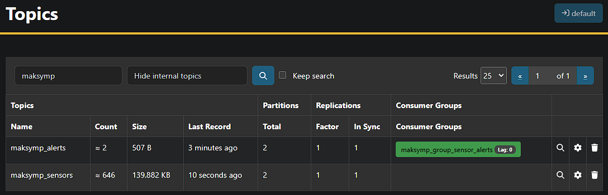

## Домашнє завдання до теми «Spark streaming»

#### 1. Генерація потоку даних

Генерацію імплементовано в файлі `producer_sensor.py`.
Каожне повідомлення відправляється в топік `f'{kafka_config['name']}_sensors'`.

Формат повідомлення

Запускаємо 4 потоки:

#### 2. Обробка даних

Читання, агрегація, фільтрація та відправка даних в топік `f'{kafka_config['name']}_alerts'` виконанна в файлі `consumer_sensors.py`.

Можемо бачити повідомлення від сенсорів в топіку `*_sensors'` та відфільтровані повідомлення в топіку `*_alerts'`.

#### 3. Отримання повідомлень

Формат повідомлення

Читання повідомлень виконанно в файлі `consumer_alerts.py`.

